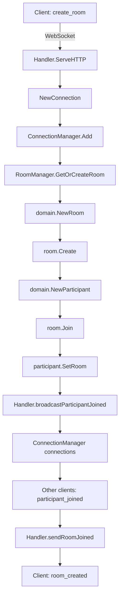
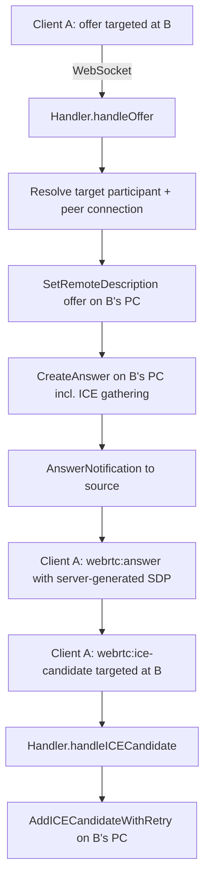

# Slive Architecture

## Overview

This document describes the architecture of Slive, a self-hosted real-time communication server. It covers the high-level design, component interactions, and how the signaling protocol integrates with the core domain model and WebSocket infrastructure.

---

## High-Level Architecture

```text
┌───────────────────────────────────────────────────────────────────────────┐
│                              Slive Server                                 │
├───────────────────────────────────────────────────────────────────────────┤
│                                                                           │
│  ┌─────────────────────────────────────────────────────────────────────┐  │
│  │                         HTTP Layer                                  │  │
│  │  ┌─────────────────────────────────────────────────────────────────┐│  │
│  │  │                      http.Server                                ││  │
│  │  │  - Listens on configurable address (default: :8080)             ││  │
│  │  │  - Manages HTTP server lifecycle (Start/Shutdown)               ││  │
│  │  └─────────────────────────────────────────────────────────────────┘│  │
│  │                                                                     │  │
│  │  ┌─────────────────────────────────────────────────────────────────┐│  │
│  │  │                       http.Router                               ││  │
│  │  │  - /health → HealthHandler (liveness check)                     ││  │
│  │  │  - /ws?room_id=&participant_id= → signaling.Handler             ││  │
│  │  │    (WebSocket upgrade; WEBSOCKET_PATH configurable)             ││  │
│  │  └─────────────────────────────────────────────────────────────────┘│  │
│  └─────────────────────────────────────────────────────────────────────┘  │
│                                                                           │
│  ┌─────────────────────────────────────────────────────────────────────┐  │
│  │                      Signaling Layer                                │  │
│  │  ┌─────────────────────────────────────────────────────────────────┐│  │
│  │  │                    signaling.Handler                            ││  │
│  │  │  - Handles WebSocket connections                                ││  │
│  │  │  - Routes messages to appropriate handlers                      ││  │
│  │  │  - Manages connection lifecycle                                 ││  │
│  │  │  - Coordinates between RoomManager and ConnectionManager        ││  │
│  │  └─────────────────────────────────────────────────────────────────┘│  │
│  │                                                                     │  │
│  │  ┌─────────────────────┐  ┌─────────────────────┐  ┌───────────────┐│  │
│  │  │   RoomManager       │  │  ConnectionManager  │  │    Handler    ││  │
│  │  │                     │  │                     │  │    Helpers    ││  │
│  │  │ - Create/Get/Close  │  │ - Add/Remove/Get    │  │ - Broadcast   ││  │
│  │  │   rooms             │  │   connections       │  │ - Notification││  │
│  │  │ - Thread-safe       │  │ - Thread-safe       │  │   helpers     ││  │
│  │  └─────────────────────┘  └─────────────────────┘  └───────────────┘│  │
│  └─────────────────────────────────────────────────────────────────────┘  │
│                                                                           │
│  ┌─────────────────────────────────────────────────────────────────────┐  │
│  │                       Domain Layer                                  │  │
│  │  ┌─────────────────┐  ┌──────────────────┐  ┌──────────────────┐    │  │
│  │  │    domain.Room  │  │domain.Participant│  │   domain.Track   │    │  │
│  │  │                 │  │                  │  │                  │    │  │
│  │  │ - ID            │  │ - ID             │  │ - ID             │    │  │
│  │  │ - State         │  │ - Name           │  │ - Kind           │    │  │
│  │  │ - Participants  │  │ - State          │  │ - Source         │    │  │
│  │  │ - Thread-safe   │  │ - Room           │  │ - State          │    │  │
│  │  │                 │  │ - pubTracks      │  │ - Publisher      │    │  │
│  │  │                 │  │ - subTracks      │  │ - Thread-safe    │    │  │
│  │  └─────────────────┘  └──────────────────┘  └──────────────────┘    │  │
│  └─────────────────────────────────────────────────────────────────────┘  │
│                                                                           │
│  ┌─────────────────────────────────────────────────────────────────────┐  │
│  │                      Support Layers                                 │  │
│  │  ┌─────────────────┐  ┌──────────────────┐  ┌─────────────────┐     │  │
│  │  │  config.Config  │  │  logger.Logger   │  │   (future)      │     │  │
│  │  │                 │  │                  │  │   SFU           │     │  │
│  │  │ - HTTPAddr      │  │ - Structured     │  │   MediaServer   │     │  │
│  │  │ - Environment   │  │   logging        │  │   (planned)     │     │  │
│  │  │   variables     │  │ - Levels         │  │                 │     │  │
│  │  └─────────────────┘  └──────────────────┘  └─────────────────┘     │  │
│  └─────────────────────────────────────────────────────────────────────┘  │
│                                                                           │
└───────────────────────────────────────────────────────────────────────────┘
```

---

## Component Details

### 1. HTTP Layer

The HTTP layer provides the entry point for all client connections and API endpoints.

#### Server (`http.Server`)
- Wraps Go's `http.Server` with configuration and dependencies
- Manages server lifecycle (startup and graceful shutdown)
- Injects configuration and logger dependencies

#### Router (`http.Router`)
- Central route registration using `http.ServeMux`
- Separates route configuration from server setup
- Registers:
  - `/health` - Health check endpoint
  - `/ws` - WebSocket signaling endpoint (`WEBSOCKET_PATH`, default `/ws`)

The signaling handler is injected into the router via `HandlerDeps.SignalingHandler`
(set through `apphttp.WithSignalingHandler` in `cmd/slive`), so the HTTP layer
does not import the signaling package and minimal deployments can omit the
route entirely. `cmd/slive` builds the handler with the runtime ICE-server
configuration (`STUN_SERVERS`/`TURN_SERVERS` → `webrtc.ICEServersFromURLs`)
and propagates the structured logger via `signaling.WithLogger`.

#### Health Handler (`http.HealthHandler`)
- Simple liveness probe endpoint
- Returns 200 OK with server status
- Used for container orchestration health checks

### 2. Signaling Layer

The signaling layer handles WebSocket connections and message routing for real-time communication.

#### Handler (`signaling.Handler`)
**Responsibilities**:
- HTTP handler for WebSocket upgrade
- Connection lifecycle management
- Message routing and processing
- Integration with domain layer

**Key Methods**:
- `ServeHTTP(w http.ResponseWriter, r *http.Request)` - WebSocket upgrade
- `handleConnection(conn *Connection)` - Connection message loop
- `handleMessage(conn, room, participant, msg)` - Message routing
- `handleCreateRoom()`, `handleJoinRoom()`, etc. - Message type handlers
- `broadcastToRoom()`, `sendRoomJoined()`, etc. - Notification helpers

#### Connection (`signaling.Connection`)
**Responsibilities**:
- WebSocket connection wrapper
- Message send/receive operations
- Connection state management

**Key Features**:
- Buffered channels for non-blocking send/receive
- Automatic message parsing and serialization
- Connection ID tracking (room_id + participant_id)
- Graceful close handling

#### ConnectionManager (`signaling.ConnectionManager`)
**Responsibilities**:
- Track all active WebSocket connections
- Provide lookup by participant ID
- Thread-safe access to connection map

**Key Methods**:
- `Add(conn *Connection)` - Register new connection
- `Remove(id string)` - Remove connection on close
- `Get(id string) *Connection` - Lookup connection by ID
- `ConnectionIDs() []string` - List all connection IDs

#### RoomManager (`signaling.RoomManager`)
**Responsibilities**:
- Manage room lifecycle
- Provide room lookup and creation
- Thread-safe access to room map

**Key Methods**:
- `CreateRoom(id string) (*domain.Room, error)` - Create new room
- `GetOrCreateRoom(id string) (*domain.Room, error)` - Get or create room
- `GetRoom(id string) *domain.Room` - Lookup existing room
- `CloseRoom(id string) error` - Close and clean up room

### 3. Domain Layer

The domain layer contains the core business logic and state management for real-time communication.

#### Room (`domain.Room`)
**Responsibilities**:
- Represent an isolated communication session
- Manage participant membership
- Track room state

**State Machine**:
```
created → active → closed
```

**Key Methods**:
- `Create() error` - Transition to active state
- `Join(participant *Participant) error` - Add participant
- `Leave(participantID string) error` - Remove participant
- `Close() error` - Transition to closed state
- `GetParticipant(id string) *Participant` - Lookup participant

#### Participant (`domain.Participant`)
**Responsibilities**:
- Represent a client in a room
- Manage published and subscribed tracks
- Track participant state

**State Machine**:
```
joined → active → left
```

**Key Methods**:
- `Activate()` - Transition to active state
- `Leave()` - Transition to left state, clean up resources
- `PublishTrack(track *Track) error` - Add published track
- `UnpublishTrack(trackID string) error` - Remove published track
- `SubscribeTrack(track *Track) error` - Add subscribed track
- `UnsubscribeTrack(trackID string) error` - Remove subscribed track

#### Track (`domain.Track`)
**Responsibilities**:
- Represent a media stream (audio or video)
- Track metadata (kind, source, state)
- Maintain publisher reference

**State Machine**:
```
created → published → unpublished
```

**Types**:
- `TrackKind`: `audio`, `video`
- `TrackSource`: `microphone`, `camera`, `screen_share`

**Key Methods**:
- `Publish()` - Transition to published state
- `Unpublish()` - Transition to unpublished state
- `SetPublisher(p *Participant)` - Set publishing participant

### 4. Support Layers

#### Configuration (`config.Config`)
- Central configuration management
- Loads from environment variables
- Provides typed access to configuration values

**Current Configuration**:
- `HTTPAddr` - HTTP server listen address

#### Logger (`logger.Logger`)
- Structured logging with levels
- Configurable output
- Context-aware logging

---

## Signaling Protocol Integration

### WebSocket Connection Flow

```text
┌─────────────┐       ┌─────────────┐       ┌─────────────┐
│   Client    │       │   HTTP      │       │  Signaling  │
│             │──────►│   Server    │──────►│   Handler   │
└─────────────┘       └─────────────┘       └─────────────┘
                          │                        │
                          │ WebSocket Upgrade      │
                          ▼                        ▼
                    ┌─────────────┐       ┌──────────────┐
                    │  Connection │       │ RoomManager  │
                    │             │       │              │
                    │ - Send/Recv │       │ - Get/Create │
                    │ - Channels  │◄─────►│ - Rooms      │
                    └─────────────┘       └──────────────┘
                          │                        │
                          │ Messages               │
                          ▼                        ▼
                    ┌─────────────┐       ┌─────────────┐
                    │   Domain    │       │   Domain    │
                    │    Room     │       │ Participant │
                    │             │       │             │
                    └─────────────┘       └─────────────┘
```

### Message Processing Pipeline

1. **WebSocket Upgrade**: Client connects to `/ws?room_id=...&participant_id=...`
2. **Connection Creation**: `NewConnection()` creates WebSocket connection wrapper
3. **Room Assignment**: Handler gets or creates room via `RoomManager.GetOrCreateRoom()`
4. **Participant Assignment**: Handler gets or creates participant, joins to room
5. **Notification**: Handler broadcasts `participant_joined` to other participants
6. **Message Loop**: Connection reads messages and passes to handler
7. **Message Routing**: Handler dispatches to appropriate message type handler
8. **Domain Operations**: Handler calls domain methods (e.g., `PublishTrack`, `SubscribeTrack`)
9. **Response**: Handler sends response back to client
10. **Broadcast**: Handler broadcasts notifications to other participants if needed

### Example: Publishing a Track

```text
Client → Handler: publish_track message
    │
    ▼
Handler → Message: Unmarshal PublishTrackRequest
    │
    ▼
Handler → domain: Create new Track(kind, source)
    │
    ▼
Handler → Participant: PublishTrack(track)
    │
    ▼
Handler → Track: SetPublisher(participant)
    │
    ▼
Handler → Client: Send track_published response
    │
    ▼
Handler → Room: Get all other participants
    │
    ▼
Handler → ConnectionManager: Get connections for other participants
    │
    ▼
Handler → Other Clients: Broadcast track_available notification
```

---

## Concurrency Model

### Goroutine Hierarchy

```text
Main Goroutine
    │
    ├── HTTP Server Goroutine (per connection)
    │       │
    │       └── WebSocket Connection Goroutine (per client)
    │               │
    │               ├── Read Loop Goroutine
    │               │       │
    │               │       └── Message Processing (synchronous)
    │               │
    │               └── Write Loop Goroutine
    │                       │
    │                       └── Message Sending (via buffered channel)
    │
    └── Background Goroutines (future: SFU, metrics, etc.)
```

### Synchronization

| Component | Synchronization Mechanism | Purpose |
|-----------|---------------------------|---------|
| `RoomManager` | `sync.RWMutex` | Protect room map access |
| `ConnectionManager` | `sync.RWMutex` | Protect connection map access |
| `domain.Room` | `sync.RWMutex` | Protect participant map and state |
| `domain.Participant` | `sync.RWMutex` | Protect track maps and state |
| `domain.Track` | `sync.RWMutex` | Protect state and publisher |
| `Connection` | Buffered channels | Non-blocking send/receive |

### Thread Safety Guarantees

1. **All domain entities are thread-safe**: Can be accessed from multiple goroutines
2. **Managers are thread-safe**: RoomManager and ConnectionManager can be called concurrently
3. **Connection operations are non-blocking**: Send/Receive use buffered channels
4. **Message processing is sequential per connection**: Each connection has its own goroutine

---

## Data Flow

### Room Creation Flow



### WebRTC Signaling Flow

The server terminates media SFU-style: it owns one peer connection per
participant and answers offers **on behalf of the target peer connection**
instead of relaying SDP verbatim between clients.



Outbound events are pushed automatically: when a server-side peer connection
needs renegotiation or gathers local ICE candidates, it sends
`webrtc:offer` / `webrtc:ice-candidate` through the owning participant's
WebSocket (the sender is re-bound on reconnect).

---

## Error Handling

### Error Propagation

```text
Client Request → Handler → Domain Operation
    │               │              │
    │               │              ▼
    │               │        domain.Error
    │               │              │
    │               ▼              ▼
    │        errorCodeFromDomainError()
    │               │
    │               ▼
    │        ErrorResponse
    │               │
    ▼               ▼
Client: error message
```

### Error Code Mapping

Domain errors are mapped via `errorCodeFromDomainError`; WebRTC and transport
errors are mapped via `errorCodeFromError` (both in `internal/signaling`).

| Error | Signaling Error Code |
|--------------|----------------------|
| `ErrRoomClosed` | `room_closed` |
| `ErrParticipantNotFound` | `participant_not_found` |
| `ErrTrackNotFound` | `track_not_found` |
| `ErrParticipantAlreadyExists` | `internal_error` |
| `ErrTrackAlreadyPublished` | `internal_error` |
| `ErrTrackAlreadySubscribed` | `internal_error` |
| validation failures (`ErrInvalidRequest`) | `invalid_request` |
| `signaling.ErrConnectionNotFound` / `webrtc.ErrNoPeerConnection` | `connection_not_found` |
| `webrtc.ErrICEFailed` (retries exhausted) | `ice_failed` |
| `webrtc.ErrPeerConnectionClosed` | `peer_connection_closed` |
| `webrtc.ErrNegotiationFailed` | `negotiation_failed` |
| `webrtc.ErrInvalidSDP` / `ErrInvalidICECandidate` / `ErrTrackNotReady` | `invalid_webrtc_message` |

### Connection Error Handling

1. **Read Error**: Log error, break message loop, trigger cleanup
2. **Write Error**: Log error, close connection, trigger cleanup
3. **WebSocket drop**: The transport registry entry is removed, but the
   participant and its peer connection stay alive for reconnection
   (`event=peer_disconnected`); the next join from the same participant ID
   reuses the live peer connection with a freshly bound signaling sender
4. **Explicit `leave_room`**: Terminal — removes the participant from the room,
   closes and deregisters the peer connection, broadcasts `participant_left`
5. **Panic**: Recover in goroutine, log error, close connection

---

## Cleanup and Resource Management

### Connection Cleanup

```text
WebSocket transport drops (reconnectable)
    │
    ├── ConnectionManager.RemoveIf(conn.ID(), conn)
    │
    ├── conn.Close()
    │
    └── Handler.handleConnectionClosed()
            │
            └── log event=peer_disconnected (participant + peer
                connection deliberately kept alive for rejoin)

Explicit leave_room (terminal)
    │
    ├── room.Leave(participantID)
    │
    ├── Handler.closePeerConnection(participantID)
    │       │
    │       └── peer connection closed + removed from handler registry
    │
    └── Handler.broadcastParticipantLeft()
            │
            └── Other clients: participant_left
```

### Room Cleanup

```text
Room.Close()
    │
    ├── Set state to RoomStateClosed
    │
    └── Clear participants map
            │
            └── All participant references removed
```

---

## Performance Considerations

### Current Implementation

1. **Memory**: All state kept in memory (no persistence)
2. **Concurrency**: Goroutine per connection model
3. **Broadcast**: O(n) where n = number of participants in room
4. **Lookup**: O(1) for room and connection lookups (map-based)

### Scalability Limits

| Resource | Current Limit | Future Solution |
|----------|---------------|-----------------|
| Memory | All state in memory | Add Redis for shared state |
| Connections | Goroutine per connection | Connection pooling |
| Rooms | Single server | Distributed room management |
| Broadcast | O(n) per message | Optimized routing |

---

## Deployment Architecture

### Single Server Deployment

```text
┌───────────────────────────────────────────────────────────────┐
│                         Server Machine                        │
│  ┌─────────────────────────────────────────────────────────┐  │
│  │                      Slive Server                       │  │
│  │  ┌─────────────┐  ┌─────────────┐  ┌─────────────┐      │  │
│  │  │  HTTP       │  │  Signaling  │  │   Domain    │      │  │
│  │  │  Server     │  │  Layer      │  │   Layer     │      │  │
│  │  └─────────────┘  └─────────────┘  └─────────────┘      │  │
│  └─────────────────────────────────────────────────────────┘  │
│                              │                                │
│                              ▼                                │
│  ┌─────────────────────────────────────────────────────────┐  │
│  │                      Clients                            │  │
│  │  ┌─────────┐  ┌─────────┐  ┌─────────┐                  │  │
│  │  │ Client  │  │ Client  │  │ Client  │                  │  │
│  │  │   1     │  │   2     │  │   3     │                  │  │
│  │  └─────────┘  └─────────┘  └─────────┘                  │  │
│  └─────────────────────────────────────────────────────────┘  │
└───────────────────────────────────────────────────────────────┘
```

### Docker Deployment

```text
┌───────────────────────────────────────────────────────────────┐
│                      Docker Container                         │
│  ┌─────────────────────────────────────────────────────────┐  │
│  │                      Slive Server                       │  │
│  │  - Built from Dockerfile                                │  │
│  │  - Exposes port 8080 (configurable)                     │  │
│  │  - Environment variables for configuration              │  │
│  └─────────────────────────────────────────────────────────┘  │
└───────────────────────────────────────────────────────────────┘
```

---

## Future Architecture Evolution

### Planned Components

```text
┌───────────────────────────────────────────────────────────────┐
│                      Future Architecture                      │
│  ┌─────────────┐  ┌─────────────┐  ┌─────────────┐            │
│  │  Signaling  │  │    SFU      │  │   Media     │            │
│  │  Server     │  │  Server     │  │  Storage    │            │
│  └─────────────┘  └─────────────┘  └─────────────┘            │
│       │               │                  │                    │
│       ▼               ▼                  ▼                    │
│  ┌─────────────────────────────────────────────────────────┐  │
│  │                      Redis Cluster                      │  │
│  │  - Shared state for distributed deployment              │  │
│  │  - Room and participant metadata                        │  │
│  └─────────────────────────────────────────────────────────┘  │
│                                                               │
│  ┌─────────────────────────────────────────────────────────┐  │
│  │                      Load Balancer                      │  │
│  │  - Distributes connections across signaling servers     │  │
│  └─────────────────────────────────────────────────────────┘  │
└───────────────────────────────────────────────────────────────┘
```

### SFU Integration (Future)

The Selective Forwarding Unit will be added to handle media routing:

```text
┌───────────────────────────────────────────────────────────────┐
│                      Media Flow with SFU                      │
│                                                               │
│  Publisher → Signaling → SFU → Subscriber                     │
│       │            │          │           │                   │
│       │ publish    │          │ forward   │                   │
│       ▼            ▼          ▼           ▼                   │
│  Media Track ───────────────────────────────────────────► Subscriber
│       │                                            │          │
│       │                                            ▼          │
│       │                                      SFU selects      │
│       │                                       best streams    │
│       │                                            │          │
│       ▼                                            ▼          │
│  RTP Packets ───────────────────────────────────────────► RTP Packets
│                                                               │
└───────────────────────────────────────────────────────────────┘
```

---

## Summary

The Slive architecture follows a clean separation of concerns:

1. **HTTP Layer**: Handles HTTP requests and WebSocket upgrades
2. **Signaling Layer**: Manages WebSocket connections and message routing
3. **Domain Layer**: Contains core business logic and state
4. **Support Layers**: Provide infrastructure (config, logging)

The signaling protocol integrates seamlessly with the domain model through well-defined interfaces, and the entire system is designed for thread safety and concurrent operation.

For detailed information about the signaling protocol, see [signaling-protocol.md](signaling-protocol.md).
