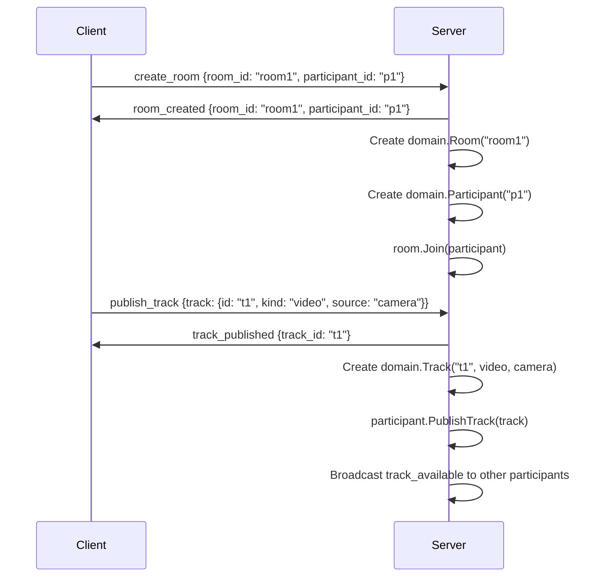
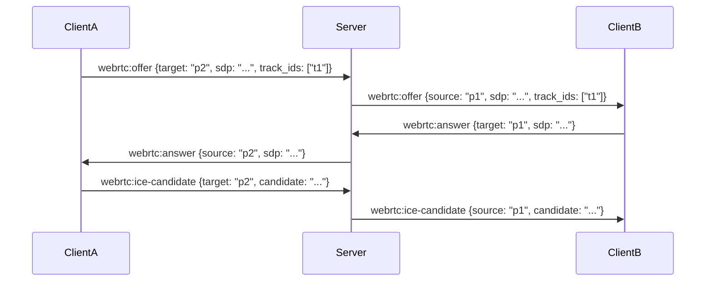

# Slive Signaling Protocol

## Overview

The Slive signaling protocol enables real-time session negotiation between participants in a room. It uses a request-response pattern over WebSocket connections to exchange signaling messages for WebRTC session establishment.

This document provides the complete specification of the signaling protocol as implemented in Sprint 01, including message formats, state machines, and integration details with the core domain model.

---

## Protocol Design

### Transport
- **Protocol**: WebSocket (RFC 6455)
- **Path**: `/ws/{roomId}?room_id={roomId}&participant_id={participantId}`
- **Message Format**: JSON
- **Library**: `github.com/gorilla/websocket`

### Connection Lifecycle

1. **Establishment**: Client connects to WebSocket endpoint with room_id and participant_id query parameters
2. **Authentication**: Currently uses query parameters (TODO: Implement proper authentication)
3. **Room Assignment**: Server gets or creates room, gets or creates participant
4. **Message Processing**: Server processes incoming messages and routes to appropriate handlers
5. **Cleanup**: On connection close, participant is removed from room and notifications are broadcast

### Message Structure

All messages follow this structure:
```json
{
  "type": "message_type",
  "data": { ... }
}
```

The `type` field is a string constant defining the message type (see Message Types section).
The `data` field contains the message-specific payload as JSON.

---

## Message Types

### 1. Room Creation

**Request (Client → Server)**:
```json
{
  "type": "create_room",
  "data": {
    "room_id": "unique-room-id",
    "participant_id": "participant-id",
    "participant_name": "Participant Name"
  }
}
```

**Response (Server → Client)**:
```json
{
  "type": "room_created",
  "data": {
    "room_id": "unique-room-id",
    "participant_id": "participant-id",
    "status": "success"
  }
}
```

**Implementation Notes**:
- Creates a new `domain.Room` with state `RoomStateActive`
- Creates a new `domain.Participant` with state `ParticipantStateJoined`
- Joins the participant to the room
- Returns error if room already exists (`ErrRoomAlreadyExists`)

---

### 2. Participant Joining

**Request (Client → Server)**:
```json
{
  "type": "join_room",
  "data": {
    "room_id": "existing-room-id",
    "participant_id": "new-participant-id",
    "participant_name": "New Participant"
  }
}
```

**Response (Server → Client)**:
```json
{
  "type": "room_joined",
  "data": {
    "room_id": "existing-room-id",
    "participant_id": "new-participant-id",
    "participants": [
      {
        "id": "participant-1",
        "name": "Existing Participant"
      }
    ],
    "status": "success"
  }
}
```

**Broadcast (Server → All Participants)**:
```json
{
  "type": "participant_joined",
  "data": {
    "participant": {
      "id": "new-participant-id",
      "name": "New Participant"
    }
  }
}
```

**Implementation Notes**:
- Gets or creates the room via `RoomManager.GetOrCreateRoom()`
- Creates a new `domain.Participant` if not already exists
- Joins the participant to the room via `room.Join(participant)`
- Broadcasts `participant_joined` to all other participants in the room
- Returns list of existing participants in the response

---

### 3. Participant Leaving

**Request (Client → Server)**:
```json
{
  "type": "leave_room",
  "data": {
    "room_id": "room-id",
    "participant_id": "participant-id"
  }
}
```

**Response (Server → Client)**:
```json
{
  "type": "room_left",
  "data": {
    "room_id": "room-id",
    "participant_id": "participant-id",
    "status": "success"
  }
}
```

**Broadcast (Server → All Participants)**:
```json
{
  "type": "participant_left",
  "data": {
    "participant_id": "participant-id"
  }
}
```

**Implementation Notes**:
- Removes participant from room via `room.Leave(participantID)`
- Broadcasts `participant_left` to all other participants
- Connection closure also triggers automatic cleanup

---

### 4. Track Management

#### Publish Track

**Request (Client → Server)**:
```json
{
  "type": "publish_track",
  "data": {
    "room_id": "room-id",
    "participant_id": "participant-id",
    "track": {
      "id": "track-id",
      "kind": "audio|video",
      "source": "microphone|camera|screen_share"
    }
  }
}
```

**Response (Server → Client)**:
```json
{
  "type": "track_published",
  "data": {
    "track_id": "track-id",
    "participant_id": "participant-id",
    "status": "success"
  }
}
```

**Broadcast (Server → All Other Participants)**:
```json
{
  "type": "track_available",
  "data": {
    "participant_id": "participant-id",
    "track": {
      "id": "track-id",
      "kind": "audio|video",
      "source": "microphone|camera|screen_share"
    }
  }
}
```

**Implementation Notes**:
- Creates a new `domain.Track` with appropriate kind and source
- Publishes track via `participant.PublishTrack(track)`
- Track state transitions to `TrackStatePublished`
- Broadcasts availability to all other participants

#### Unpublish Track

**Request (Client → Server)**:
```json
{
  "type": "unpublish_track",
  "data": {
    "room_id": "room-id",
    "participant_id": "participant-id",
    "track_id": "track-id"
  }
}
```

**Response (Server → Client)**:
```json
{
  "type": "track_unpublished",
  "data": {
    "track_id": "track-id",
    "participant_id": "participant-id",
    "status": "success"
  }
}
```

**Broadcast (Server → All Other Participants)**:
```json
{
  "type": "track_unavailable",
  "data": {
    "participant_id": "participant-id",
    "track_id": "track-id"
  }
}
```

#### Subscribe to Track

**Request (Client → Server)**:
```json
{
  "type": "subscribe_track",
  "data": {
    "room_id": "room-id",
    "participant_id": "participant-id",
    "track_id": "track-id"
  }
}
```

**Response (Server → Client)**:
```json
{
  "type": "track_subscribed",
  "data": {
    "track_id": "track-id",
    "publisher_id": "publisher-participant-id",
    "status": "success"
  }
}
```

**Implementation Notes**:
- Finds the publisher participant and their published track
- Subscribes via `participant.SubscribeTrack(track)`
- Returns error if track or publisher not found

---

### 5. Session Negotiation (WebRTC SDP Exchange)

#### Offer Exchange

**Offer (Client → Server)**:
```json
{
  "type": "webrtc:offer",
  "data": {
    "room_id": "room-id",
    "participant_id": "participant-id",
    "target_participant_id": "target-participant-id",
    "sdp": "base64-encoded-sdp",
    "track_ids": ["track-id-1", "track-id-2"]
  }
}
```

**Server Relay (Server → Target Client)**:
```json
{
  "type": "webrtc:offer",
  "data": {
    "source_participant_id": "participant-id",
    "sdp": "base64-encoded-sdp",
    "track_ids": ["track-id-1", "track-id-2"]
  }
}
```

**Answer (Client → Server)**:
```json
{
  "type": "webrtc:answer",
  "data": {
    "room_id": "room-id",
    "participant_id": "participant-id",
    "target_participant_id": "target-participant-id",
    "sdp": "base64-encoded-sdp"
  }
}
```

**Server Relay (Server → Source Client)**:
```json
{
  "type": "webrtc:answer",
  "data": {
    "source_participant_id": "target-participant-id",
    "sdp": "base64-encoded-sdp"
  }
}
```

**Implementation Notes**:
- Server acts as a relay for SDP messages between participants
- Uses `ConnectionManager` to find target connection
- Returns `ErrConnectionNotFound` if target participant is not connected

#### ICE Candidate Exchange

**ICE Candidate (Client → Server)**:
```json
{
  "type": "webrtc:ice-candidate",
  "data": {
    "room_id": "room-id",
    "participant_id": "participant-id",
    "target_participant_id": "target-participant-id",
    "candidate": "base64-encoded-candidate",
    "sdp_mid": "mid",
    "sdp_mline_index": 0
  }
}
```

**Server Relay (Server → Target Client)**:
```json
{
  "type": "webrtc:ice-candidate",
  "data": {
    "source_participant_id": "participant-id",
    "candidate": "base64-encoded-candidate",
    "sdp_mid": "mid",
    "sdp_mline_index": 0
  }
}
```

---

### 6. Error Messages

**Error Response (Server → Client)**:
```json
{
  "type": "error",
  "data": {
    "error": "error_message",
    "code": "error_code",
    "request_type": "original_request_type"
  }
}
```

**Error Codes**:
- `room_not_found` - Room does not exist
- `room_closed` - Room is in closed state
- `participant_not_found` - Participant does not exist
- `track_not_found` - Track does not exist
- `invalid_request` - Malformed or invalid request
- `internal_error` - Internal server error

---

## State Machine

### Room States
```
┌──────────┐    create()     ┌──────────┐    close()     ┌──────────┐
│  created  │ ─────────────► │  active   │ ─────────────► │  closed   │
└──────────┘                └──────────┘                └──────────┘
```

**Transitions**:
- `created` → `active`: `Room.Create()` - Initializes room for use
- `active` → `closed`: `Room.Close()` - Cleans up all participants
- `closed` → `closed`: Idempotent, no error

### Participant States
```
┌──────────┐    join()      ┌──────────┐    leave()     ┌──────────┐
│  joined   │ ─────────────► │  active   │ ─────────────► │  left     │
└──────────┘                └──────────┘                └──────────┘
```

**Transitions**:
- `joined` → `active`: `Participant.Activate()` - Participant is fully connected
- `active` → `left`: `Participant.Leave()` - Cleans up tracks and room reference
- `left` → `left`: Terminal state, no further transitions

### Track States
```
┌──────────┐    publish()    ┌──────────┐    unpublish()  ┌─────────────┐
│  created  │ ─────────────► │ published │ ─────────────► │ unpublished  │
└──────────┘                └──────────┘                └─────────────┘
```

**Transitions**:
- `created` → `published`: `Track.Publish()` - Track is available for subscription
- `published` → `unpublished`: `Track.Unpublish()` - Track is no longer available

---

## Implementation Details

### Components

#### Handler (`signaling.Handler`)
- HTTP handler for WebSocket connections
- Manages message routing and processing
- Coordinates between `RoomManager` and `ConnectionManager`
- Implements all message type handlers

#### Connection (`signaling.Connection`)
- WebSocket connection wrapper
- Provides buffered channels for send/receive operations
- Manages connection lifecycle
- Tracks room ID and participant ID

#### ConnectionManager (`signaling.ConnectionManager`)
- Manages all active WebSocket connections
- Thread-safe with mutex protection
- Provides lookup by participant ID
- Handles connection registration and removal

#### RoomManager (`signaling.RoomManager`)
- Manages room lifecycle
- Thread-safe with mutex protection
- Creates, retrieves, and closes rooms
- Maps room IDs to `domain.Room` instances

### Integration with Domain Layer

The signaling layer integrates with the domain layer as follows:

```text
┌─────────────────────────────────────────────────────────────┐
│                    Signaling Layer                              │
│  Handler ──► RoomManager ──► domain.Room                       │
│       │            │                                              │
│       │            ▼                                              │
│       │       domain.Participant                                  │
│       │            │                                              │
│       ▼            ▼                                              │
│  ConnectionManager ──► domain.Track                              │
└─────────────────────────────────────────────────────────────┘
```

**Key Integrations**:
- `RoomManager.CreateRoom()` → `domain.NewRoom()` + `room.Create()`
- `room.Join(participant)` → `domain.Participant.SetRoom()`
- `participant.PublishTrack(track)` → `domain.Track.SetPublisher()`
- `participant.SubscribeTrack(track)` → Track added to subTracks map

### Concurrency Model

1. **Connection Goroutines**: Each WebSocket connection runs in its own goroutine
2. **Channel-based Communication**: Connections use buffered channels for message passing
3. **Mutex Protection**: RoomManager and ConnectionManager use mutexes for thread-safe access
4. **Domain Thread Safety**: All domain entities (Room, Participant, Track) are thread-safe

### Error Handling

1. **Domain Errors**: Converted to signaling error codes via `errorCodeFromDomainError()`
2. **Connection Errors**: Handled gracefully with cleanup
3. **Invalid Messages**: Result in error responses
4. **Connection Closure**: Triggers automatic cleanup of participant state

---

## Protocol Flow Examples

### Example 1: Creating a Room and Publishing a Track



### Example 2: WebRTC Offer/Answer Exchange



---

## Testing

The signaling protocol implementation includes comprehensive tests:

### Unit Tests
- `TestRoomManager_CreateRoom` - Room creation and duplicate prevention
- `TestRoomManager_GetOrCreateRoom` - Room retrieval and creation
- `TestRoomManager_CloseRoom` - Room closure and cleanup
- `TestConnectionManager_AddRemove` - Connection management
- `TestMessage_CreateAndParse` - Message serialization/deserialization
- `TestErrorCodeFromDomainError` - Error code mapping

### Integration Tests
- `TestHandler_JoinRoom` - Full join room flow
- `TestHandler_PublishTrack` - Track publishing flow
- `TestHandler_WebRTCSignaling` - Offer/answer exchange

### Running Tests

```bash
# Run all signaling tests
go test ./internal/signaling/...

# Run with race detector
go test -race ./internal/signaling/...

# Run specific test
go test ./internal/signaling/... -run TestRoomManager_CreateRoom
```

---

## Future Enhancements

The following features are planned for future sprints:

1. **Authentication**: Replace query parameter auth with proper JWT or token-based auth
2. **Authorization**: Implement room access control and permissions
3. **SFU Integration**: Add Selective Forwarding Unit for media routing
4. **Reconnection**: Implement automatic reconnection with session recovery
5. **Heartbeat**: Add connection keep-alive mechanism
6. **Metrics**: Add protocol metrics and monitoring
7. **Rate Limiting**: Implement message rate limiting per connection
8. **Message Validation**: Add schema validation for incoming messages

---

## References

- [WebSocket Protocol (RFC 6455)](https://datatracker.ietf.org/doc/html/rfc6455)
- [WebRTC Specification](https://webrtc.org/specification/)
- [Gorilla WebSocket](https://github.com/gorilla/websocket)
- [LiveKit Architecture](https://github.com/livekit/livekit) - Inspiration for architecture
